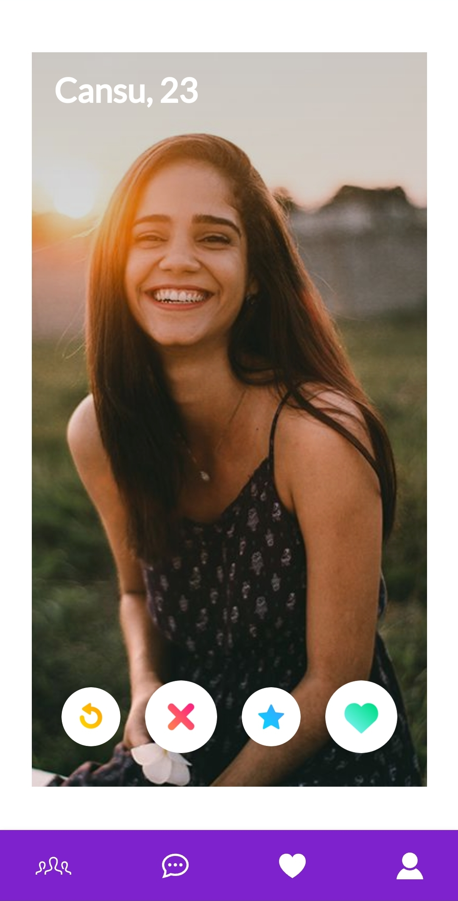

# Realtime Dating Website with Vue 3 and TypeScript

Welcome to the repository for our Realtime Dating Website built using Vue 3, TypeScript, and Firebase services! This project allows users to match, chat in real-time, and create accounts for an engaging dating experience. We've leveraged Firebase Hosting, Firestore, Firebase Storage, and the 'vue-advanced-cropper' npm package to bring this project to life.

## Features

- **User Authentication:** Users can easily create accounts and log in securely to access the dating platform.

- **Realtime Matching:** Our sophisticated matching algorithm helps users find potential partners based on shared interests and preferences.

- **Real-time Chat:** Once matched, users can engage in seamless real-time conversations using our chat feature.

- **Profile Pictures:** We've integrated the 'vue-advanced-cropper' npm package to enhance user experience while uploading and cropping profile pictures.

## Technologies Used

- **Vue 3:** Our frontend is built using Vue 3, providing a modern and dynamic user interface.

- **TypeScript:** TypeScript brings static typing to the project, enhancing code quality and maintainability.

- **Firebase Hosting:** The website is hosted on Firebase Hosting, ensuring fast and reliable access for users.

- **Firestore:** We've utilized Firestore for real-time data synchronization, enabling instant updates for matches and chat messages.

- **Firebase Storage:** Firebase Storage is used to securely store and manage user profile pictures.

- **vue-advanced-cropper:** We've integrated the 'vue-advanced-cropper' npm package to facilitate easy and efficient profile picture cropping.

- **Pinia:** We've used Pinia for state management, making our application's data flow smooth and efficient.

## Demo

Check out our Realtime Dating Website in action: [Live Demo](https://myapp-4e79c.web.app/login)

## Getting Started

1. Clone the repository: `git clone https://github.com/efeturkemir/vue-dating-app.git`
2. Navigate to the project directory: `cd your-repo`
3. Install dependencies: `npm install`
4. Configure Firebase:
   - Create a Firebase project at [Firebase Console](https://console.firebase.google.com/).
   - Obtain your Firebase configuration and replace it in the project's configuration files.
5. Start the development server: `npm run serve`
6. Access the website locally at `http://localhost:8080`

## Project Structure

- `src/` contains the main source code of the project.
- `src/components/` holds the Vue components used in the project.
- `src/views/` includes different views/routes of the website.
- `src/firebase/` contains Firebase configuration and setup.
- `public/` contains static assets and the main HTML file.

## Contributions

Contributions are welcome! If you'd like to contribute to the project, please follow these steps:

1. Fork the repository.
2. Create a new branch: `git checkout -b feature/your-feature-name`
3. Make your changes and commit: `git commit -m "Add your feature"`
4. Push to the branch: `git push origin feature/your-feature-name`
5. Create a pull request explaining your changes.

## License

This project is licensed under the [MIT License](LICENSE).

